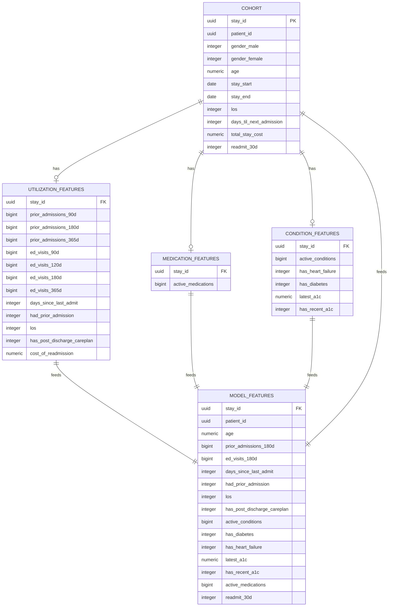

# 30-Day Hospital Readmission Risk Prediction
> An end-to-end ML pipeline that predicts which inpatients are at high risk of unplanned 30-day readmission, so care teams can prioritize post-discharge intervention where it matters most.

---

## Skills & Tools
> All skills and tools showcased in this project. More details later in the document.

**Machine Learning & Data Science**
- Predictive Modeling · Feature Engineering · Model Interpretability · Statistical Analysis · Data Leakage Diagnosis


**Data Engineering & Cloud**
- SQL & Database Design · ETL Pipeline Design · Cloud Infrastructure


**Visualization & Communication**
- Dashboard Design · Data Storytelling


**Languages**
- Python · SQL


**ML & Data**
- XGBoost · scikit-learn · pandas · SHAP · MLflow


**Cloud & Infrastructure**
- AWS S3 · AWS RDS · AWS SageMaker · AWS Step Functions

**Databases & Visualization**
PostgreSQL · Tableau

---

## Table of Contents
1. [Project Overview](#1-project-overview)
2. [Objectives](#2-objectives)
3. [Project Scope & Tools](#3-project-scope--tools)
4. [Repository Structure](#4-repository-structure)
5. [Data Workflow](#5-data-workflow)
6. [Data Model & Schema](#6-data-model--schema)
7. [ERD - Entity Relationship Diagram](#7-erd---entity-relationship-diagram)
8. [Analysis & Metrics](#8-analysis--metrics)
9. [Key Insights](#9-key-insights)
10. [Recommendations](#10-recommendations)
11. [Assumptions & Limitations](#11-assumptions--limitations)
12. [Future Enhancements](#12-future-enhancements)
13. [Deliverables](#13-deliverables)
14. [Author](#14-author)

---

## 1. Project Overview

**Context:** Unexpected hospital readmissions are avoidable and very inconvenient for everyone involved. From the patient to the hospital, no one benefits from a readmission. If care teams had a way to identify which discharging patients are most likely to return, they would be able to distribute their limited post-discharge resources to patients who are at higher risk rather than treating every patient the exact same.

**Problem Statement:** Can patient clinical history, available at the time of discharge, be used to reliably and accurately predict which patients are at higher risk of readmission within 30 days? If so, can it be used to create an actionable, cost-justified intervention strategy?

**Approach:** Built a fully data-engineered pipeline that ingested raw clinical data into a two-schema AWS RDS/PostgreSQL warehouse, engineered look-back windows for features, compared many baseline model performances, then ultimately trained an XGBoost classification model in AWS SageMaker that used SHAP for interpretability. After a significant amount of time spent on backtesting and model validation, the model was deemed ready for production.

**Outcome:** A deployed XGBoost model using a 0.10 probability threshold, evaluated primarily on AUC-PR due to the data's class imbalance. The model will be backed by multiple Tableau dashboards and a six-point story translating model output into business impact so that decision-makers can truly understand the difference the model can help make both for hospital operations and quality of care for patients.

---

## 2. Objectives

- **Primary Objective:** Build a classification model that accurately outputs a patient's risk for readmission within 30 days at the time of discharge.
- **Secondary Objective 1:** Engineer a reproducible, leakage-free feature pipeline from raw synthetic EHR data (labs, conditions, medications, utilization history).
- **Secondary Objective 2:** Rigorously validate that model performance reflects genuine signal as opposed to data leakage.
- **Secondary Objective 3:** Translate model output into business impact that anyone, technical or non-technical, can understand.

> 💡 *Every analysis decision in this project traces back to one of these objectives.*

---

## 3. Project Scope & Tools

### Scope

| Dimension        | Details                                                                                                                                                                                                                                                                                                                                                             |
| ---------------- | ------------------------------------------------------------------------------------------------------------------------------------------------------------------------------------------------------------------------------------------------------------------------------------------------------------------------------------------------------------------- |
| **In Scope**     | Synthea-generated synthetic inpatient encounters, conditions, medications, and lab results; feature engineering across utilization/condition/medication lookback windows; model training, threshold selection, and interpretability (SHAP); Tableau reporting suite.                                                                                                |
| **Out of Scope** | This project uses generated synthetic patient data, so the data doesn't include real PHI, but it was treated as such. It was not used, stored, or processed at any stage to adhere to HIPAA guidelines. Fields like ssn, drivers, and passport are synthetic, and HIPAA does not apply, but the pipeline is structured as if it did, to reflect realistic practice. |
| **Time Period**  | Synthetic patient encounter history generated by Synthea; savings projections estimated on average admission volume and other data from the years 2021–2025.                                                                                                                                                                                                        |
| **Granularity**  | Encounter/admission-level records, aggregated into patient-level features via multi-domain look-back windows and foreign keys.                                                                                                                                                                                                                                      |

### Tools & Technologies

| Category            | Tool(s) Used                                                                                                                                 |
| ------------------- | -------------------------------------------------------------------------------------------------------------------------------------------- |
| Data Storage        | AWS S3 (raw, cleaned, models), AWS RDS / PostgreSQL (staging + features schemas)                                                             |
| Data Processing     | Python (pandas), SQL, `aws_s3` extension for S3 → RDS ingestion, AWS Step Functions (pipeline orchestration)                                 |
| Analysis / Modeling | XGBoost (primary model), scikit-learn (logistic regression & random forest baselines), SHAP (interpretability), MLflow (experiment tracking) |
| Visualization       | Tableau (2-dashboard suite + Tableau Story)                                                                                                  |
| Deployment          | AWS SageMaker                                                                                                                                |
| Version Control     | Git / GitHub                                                                                                                                 |
| Documentation       | Markdown                                                                                                                                     |
| Other               | Custom Python metrics extraction script (`extract_model_metrics.py`) feeding Tableau dashboards                                              |

---

## 4. Repository Structure

```
readmission-prediction/
│
├── data/
│   ├── raw/                  # Synthea-generated synthetic patient data
│   ├── processed/            # Cleaned, feature-engineered tables
│   └── external/             # LOINC/ICD-10/RxNorm reference tables
│
├── notebooks/                # EDA, leakage investigation, model comparison notebooks
│
├── scripts/
│   └── extract_model_metrics.py   # Pulls model + eval metrics for Tableau dashboards
│
├── queries/
│   ├── exploratory/          # Ad-hoc investigation (incl. leakage audit queries)
│   ├── transformations/      # Staging → features schema logic, lookback windows
│   └── final/                # Production feature-build queries
│
├── reports/                  # Tableau Story export
│
├── visuals/                  # Dashboard exports, SHAP plots, ERD
│
├── docs/                     # Data dictionary, schema notes, leakage investigation writeup
│
├── project_metadata.yml
└── README.md
```

---

## 5. Data Workflow

```
[Synthea synthetic EHR generator]
      ↓
[S3 raw zone - Hive-style partitioning]
      ↓
[RDS PostgreSQL — staging schema (aws_s3 ingestion)]
      ↓
[Feature engineering — features schema]
      ↓
[XGBoost / LogReg / RF training + SHAP + MLflow tracking]
      ↓
[SageMaker deployment + Tableau dashboards/Story]
```

1. **Source:** Synthea generated synthetic patient populations with semi-realistic encounter, condition, medication, and utilization histories.
2. **Ingestion:** Raw data landed in S3 with Hive-style partitioning, then bulk-loaded into an RDS PostgreSQL **staging** schema using the `aws_s3` extension.
3. **Cleaning:** XGBoost was left with raw null values, the decision tree baseline was imputed with sentinel values, and the logistic regression baseline used median imputation. Overlapping inpatient stays was also merged using the popular gaps-and-islands SQL logic.
4. **Transformation:** Built a separate features schema, engineered chronic condition flags, medication counts, and utilization history across multiple look-back windows (e.g., prior admissions, ED visits).
5. **Analysis:** Trained XGBoost as the primary model against logistic regression and random forest baselines, with staged hyperparameter tuning (`RandomizedSearchCV`), patient-level cross-validation, and SHAP for feature attribution. AUC-PR used as the primary metric given class imbalance; operating threshold set to 0.10.
6. **Output:** SageMaker-deployed model, MLflow-tracked experiment history, `extract_model_metrics.py` output feeding a three-part Tableau deliverable (two technical dashboards + a six-point Story for non-technical stakeholders).

---

## 6. Data Model & Schema

The features layer is built as five tables in the `features` schema: a base cohort table, three domain-specific feature tables (utilization, medication, condition), and a final model-ready table that joins everything on `stay_id`.

### `features.cohort`

Base population table — one row per inpatient stay, with the outcome label.

|Field Name|Data Type|Nullable|Description|
|---|---|---|---|
|`stay_id`|uuid|NO|Primary key — unique identifier for the inpatient stay|
|`patient_id`|uuid|YES|Patient identifier|
|`gender_male`|integer|YES|Binary flag — 1 if patient is male|
|`gender_female`|integer|YES|Binary flag — 1 if patient is female|
|`age`|numeric|YES|Patient age at time of stay|
|`stay_start`|date|YES|Admission date|
|`stay_end`|date|YES|Discharge date|
|`los`|integer|YES|Length of stay (days)|
|`days_til_next_admission`|integer|YES|Days between this discharge and the next admission, if any|
|`total_stay_cost`|numeric|YES|Total cost of the inpatient stay|
|`readmit_30d`|integer|YES|**Target label** — 1 if a new admission occurred within 30 days of discharge|

### `features.utilization_features`

Prior healthcare utilization, keyed on `stay_id`.

|Field Name|Data Type|Nullable|Description|
|---|---|---|---|
|`stay_id`|uuid|YES|Foreign key → `features.cohort.stay_id`|
|`prior_admissions_90d`|bigint|YES|Inpatient admissions in the 90 days prior|
|`prior_admissions_180d`|bigint|YES|Inpatient admissions in the 180 days prior|
|`prior_admissions_365d`|bigint|YES|Inpatient admissions in the 365 days prior|
|`ed_visits_90d`|bigint|YES|ED visits in the 90 days prior|
|`ed_visits_120d`|bigint|YES|ED visits in the 120 days prior|
|`ed_visits_180d`|bigint|YES|ED visits in the 180 days prior|
|`ed_visits_365d`|bigint|YES|ED visits in the 365 days prior|
|`days_since_last_admit`|integer|YES|Days since the patient's most recent prior admission|
|`had_prior_admission`|integer|YES|Binary flag — 1 if any prior admission exists|
|`los`|integer|YES|Length of stay (days) for this encounter|
|`has_post_discharge_careplan`|integer|YES|Binary flag — 1 if a post-discharge care plan was in place|
|`cost_of_readmission`|numeric|YES|Cost associated with the readmission event, where applicable|

### `features.medication_features`

Active medication burden at discharge, keyed on `stay_id`.

|Field Name|Data Type|Nullable|Description|
|---|---|---|---|
|`stay_id`|uuid|YES|Foreign key → `features.cohort.stay_id`|
|`active_medications`|bigint|YES|Count of active medications at time of discharge|

### `features.condition_features`

Chronic condition burden and key lab markers, keyed on `stay_id`.

|Field Name|Data Type|Nullable|Description|
|---|---|---|---|
|`stay_id`|uuid|YES|Foreign key → `features.cohort.stay_id`|
|`active_conditions`|bigint|YES|Count of active chronic conditions|
|`has_heart_failure`|integer|YES|Binary flag — 1 if patient has an active heart failure diagnosis|
|`has_diabetes`|integer|YES|Binary flag — 1 if patient has an active diabetes diagnosis|
|`latest_a1c`|numeric|YES|Most recent A1c lab result (LOINC `4548-4`)|
|`has_recent_a1c`|integer|YES|Binary flag — 1 if an A1c result exists within the lookback window|

### `features.model_features` _(final table fed to the model)_

Join of `cohort` + all three domain feature tables on `stay_id` — this is the table the XGBoost/logistic regression/random forest models train and predict on.

|Field Name|Data Type|Nullable|Description|
|---|---|---|---|
|`stay_id`|uuid|YES|Unique stay identifier|
|`patient_id`|uuid|YES|Patient identifier|
|`age`|numeric|YES|Patient age at time of stay|
|`prior_admissions_180d`|bigint|YES|Inpatient admissions in the 180 days prior|
|`ed_visits_180d`|bigint|YES|ED visits in the 180 days prior|
|`days_since_last_admit`|integer|YES|Days since the patient's most recent prior admission|
|`had_prior_admission`|integer|YES|Binary flag — 1 if any prior admission exists|
|`los`|integer|YES|Length of stay (days)|
|`has_post_discharge_careplan`|integer|YES|Binary flag — 1 if a post-discharge care plan was in place|
|`active_conditions`|bigint|YES|Count of active chronic conditions|
|`has_diabetes`|integer|YES|Binary flag — 1 if patient has an active diabetes diagnosis|
|`has_heart_failure`|integer|YES|Binary flag — 1 if patient has an active heart failure diagnosis|
|`latest_a1c`|numeric|YES|Most recent A1c lab result|
|`has_recent_a1c`|integer|YES|Binary flag — 1 if a recent A1c result exists|
|`active_medications`|bigint|YES|Count of active medications at discharge|
|`readmit_30d`|integer|YES|**Target label**|

> **Key join:** all feature tables join back to `features.cohort` on `stay_id`. `readmit_30d` is carried through from `cohort` as the training target.

*See Section 7 for the staging → features schema relationship.*

---

## 7. ERD - Entity Relationship Diagram



**Table Relationships Summary:**

| Relationship                              | Join Key  | Type       |
| ----------------------------------------- | --------- | ---------- |
| `cohort` → `utilization_features`         | `stay_id` | One-to-One |
| `cohort` → `medication_features`          | `stay_id` | One-to-One |
| `cohort` → `condition_features`           | `stay_id` | One-to-One |
| `cohort` → `model_features`               | `stay_id` | One-to-One |
| `utilization_features` → `model_features` | `stay_id` | One-to-One |
| `medication_features` → `model_features`  | `stay_id` | One-to-One |
| `condition_features` → `model_features`   | `stay_id` | One-to-One |

---

## 8. Analysis & Metrics

### Analytical Approach

This was a supervised binary classification problem (30-day readmission: yes/no) with meaningful class imbalance. Three baseline models were benchmarked at the beginning. Those models being XGBoost, Logistic Regression, and Random Forest. All roughly performed the same, but the ultimate choice was XGBoost due to it's ability to capture non-linear relationships. Because of the imbalance of the data (very few readmissions), AUC-PR was used as the primary evaluation metric rather than just AUC-ROC alone. The operating threshold was intentionally tuned (0.10) to prioritize sensitivity for flagging at-risk patients over raw accuracy. A large portion of the analytical effort on this project was spent on a data leakage investigation. After unexpectedly high performance, it was deeply looked into and validated. It was determined that due to deterministic generation of the synthetic data that it was very likely that the model could perform extremely well finding the underlying patterns.

### Key Metrics Defined

| Metric                       | Plain-Language Definition                                                                      | Why It Matters                                                                                                                  |
| ---------------------------- | ---------------------------------------------------------------------------------------------- | ------------------------------------------------------------------------------------------------------------------------------- |
| `AUC-PR`                     | Precision-recall trade-off across thresholds                                                   | **Primary metric** - more informative than AUC-ROC under class imbalance                                                        |
| `AUC-ROC`                    | Model's ability to rank readmitted vs. non-readmitted patients correctly across all thresholds | Standard discrimination benchmark; useful for comparing against baselines                                                       |
| `Operating Threshold (0.10)` | Probability cutoff above which a patient is flagged high-risk                                  | Chosen to favor catching more true positives, accepting more false positives, appropriate for a screening use case              |
| `Cost-Weighted Savings`      | Projected net savings from intervening on flagged patients                                     | Ties model output to a business case: `COST_PER_INTERVENTION=$300`, `AVG_READMISSION_COST=$16,300`, `INTERVENTION_EFFICACY=20%` |

### Methods Used

- Staged hyperparameter tuning via `RandomizedSearchCV`
- Patient-level cross-validation (`GroupShuffleSplit` / `StratifiedGroupKFold`) to prevent train/test leakage
- SHAP for global and local feature interpretability
- Threshold selection tuned to the AUC-PR curve rather than default 0.5
- Shuffled-label sanity test and independent holdout cohort to validate post-fix performance
- Probability-weighted cost-benefit modeling for intervention savings projections

---

## 9. Key Insights

**Insight 1: High post-fix AUC-ROC (~0.91) reflects Synthea's rule-based generative logic, not remaining leakage.**
After a shuffled-label sanity test and using an entirely separate cohort, it was confirmed that the signal was related to the dataset and its generation method. Synthea generates its synthetic patient data with a more deterministic clinical logic than real populations, because it can't capture the little nuances of the real world. So the level of performance of this model should not be expected to transfer to real-world EHR data.

**Insight 2: AUC-PR and a low 0.10 threshold were necessary, not incidental, choices.**
Given class imbalance, AUC-ROC alone would not have properly captured the model's true performance. It takes true negatives into account, which is obviously going to be very high in a scenario like hospital readmissions. This would deceptively inflate performance. AUC-PR was selected as the primary metric due to how it focuses entirely on the minority/positive class. Choosing an operating threshold of 0.10 was a deliberate trade-off that favors recall.

**Insight 3: Number of admissions and ED visits in the last 180 days, along with whether the patient had a post-discharge care plan, were leading drivers by SHAP.**
This shows that recent utilization history and post-discharge planning are very important when it comes to whether a patient may be readmitted. Being able to prove that post-discharge care plans make a significant difference in whether a patient will be readmitted is very strong information to bring to stakeholders' attention.

---

## 10. Recommendations

| Priority | Recommendation                                                                                                                               | Based On  | Suggested Owner                           |
| -------- | -------------------------------------------------------------------------------------------------------------------------------------------- | --------- | ----------------------------------------- |
| High     | Pilot a targeted post-discharge outreach program for patients flagged above the 0.10 risk threshold before any broader rollout               | Insight 2 | Care management / discharge planning team |
| Medium   | Validate the pipeline and model against real (de-identified) claims or EHR data before drawing conclusions about real-world performance      | Insight 1 | Data science / clinical informatics       |
| Low      | Extend feature set with social determinants of health (housing, transportation access) if a real dataset with those fields becomes available | Insight 3 | Data engineering                          |

---

## 11. Assumptions & Limitations

### Assumptions
- Synthea patient data is assumed representative enough to prototype a pipeline and modeling approach, but not to be used on real world data until the underlying model is trained on real-world data.
- The discharge-to-admission gap definition (≤30 days) is accepted as the ground-truth readmission label.
- Cost constants (`$300` per intervention, `$16,300` average readmission cost, `20%` intervention efficacy) are treated as reasonable planning estimates, not measured values from a real program.

### Limitations
- Synthea generated patient data. Synthea's rule-based data generation system makes readmission patterns more learnable than real-world data because it lacks randomness and complex nuances. Performance on real-world data would likely be much lower. This model is not meant to be used in any real world scenario.
- Efficacy is applied uniformly. The 20% figure is a population-level estimate and not validated for this specific scenario, and effectiveness would likely vary by condition and risk level.
- Operational capacity not modeled or accounted for. The savings model assumes that every flagged patient will receive outreach and doesn't check this against staffing capacity or anything that would affect the ability to reach out to every single patient the same.

---

## 12. Future Enhancements

- Validate the pipeline and model against a real (de-identified) claims or EHR dataset
- Build a SHAP-based, clinician-facing explanation view for individual patient risk scores
- Add prospective monitoring / drift detection if the model were ever deployed against a live data stream

---

## 13. Deliverables

| Deliverable | Description | Location |
|-------------|-------------|----------|
| Trained model (XGBoost) | Final model artifact, deployed via SageMaker | [`/code/model/model.tar.gz`](/code/model/model.tar.gz) |
| `load_model_and_export_metrics.ipynb` | Script that loads model, runs it on data, and pulls evaluation metrics | `/code/notebooks/load_model_and_export_metrics.ipynb` |
| Readmission Overview | Dashboard that shows the financial magnitude of readmissions | `/visuals/readmission_overview.md` |
| Model Metrics Dashboard | Dashboard that shows technical model metrics. PR curve, calibration, SHAP, threshold comparison | `/visuals/model_metrics_overview.md` |
| Tableau Story | Six-point non-technical stakeholder narrative | `/visuals/stakeholder_story.md` |
| Leakage Investigation Write-up | Detailed write-up on the leakage investigation (methods used, tests ran, etc.) | `/reports/leakage_investigation_report.md` |

---

## 14. Author

**Christian Fure**
Computer Science graduate pursuing healthcare/clinical data analytics & machine learning

- 🔗 [LinkedIn](https://www.linkedin.com/in/christian-fure-771462201/)
- 💼 [GitHub](https://github.com/ChristianFure)
- 📧 christianjfure@gmail.com

---

*Last updated: [August 2026]*
