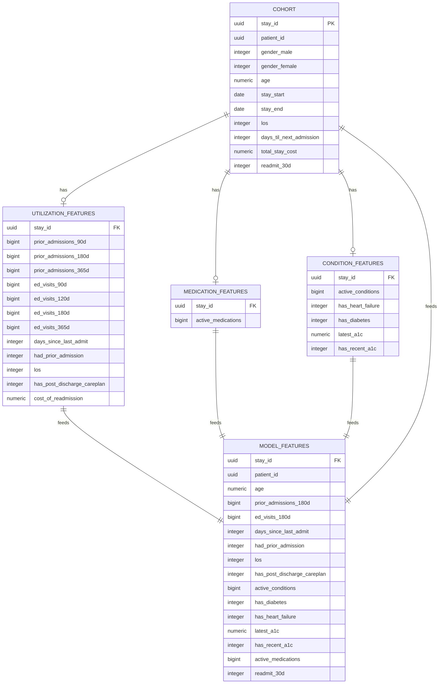

## Data Files

| File | Description | S3 Link |
|------|-------------|---------|
| `cohort.csv` | All patient stays used to train and test the model. | [Link](https://readmission-prediction-synthea-data-811136281995-us-east-2-an.s3.us-east-2.amazonaws.com/synthea_data_for_readmission_prediction/processed/cohort/year%3D2026/month%3D07/cohort.csv) |
| `condition_features.csv` | Features related to patient's conditions during look-back window. | [Link](https://readmission-prediction-synthea-data-811136281995-us-east-2-an.s3.us-east-2.amazonaws.com/synthea_data_for_readmission_prediction/processed/features/year%3D2026/month%3D07/condition_features.csv) |
| `medication_features.csv` | Features related to patient's active medications at discharge. | [Link](https://readmission-prediction-synthea-data-811136281995-us-east-2-an.s3.us-east-2.amazonaws.com/synthea_data_for_readmission_prediction/processed/features/year%3D2026/month%3D07/medication_features.csv) |
| `utilization_features.csv` | Features related to patient's recent hospital usage. | [Link](https://readmission-prediction-synthea-data-811136281995-us-east-2-an.s3.us-east-2.amazonaws.com/synthea_data_for_readmission_prediction/processed/features/year%3D2026/month%3D07/utilization_features.csv) |
| `model_features.csv` | The final table where every stay_id combines with all the features from the above tables. | [Link](https://readmission-prediction-synthea-data-811136281995-us-east-2-an.s3.us-east-2.amazonaws.com/synthea_data_for_readmission_prediction/processed/model_ready/year%3D2026/month%3D07/model_features.csv) |

'''
