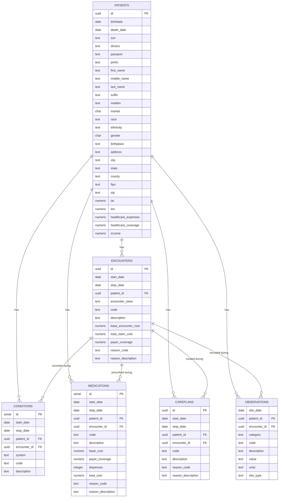

| File | Description | S3 Link |
|------|-------------|---------|
| `patients.csv` | One row per patient, with demographics (birthdate, race, ethnicity, gender, marital status), identifiers (SSN, driver's license, passport), address/location, and lifetime financial summary fields (healthcare expenses, coverage, income). | [Link](https://readmission-prediction-synthea-data-811136281995-us-east-2-an.s3.us-east-2.amazonaws.com/synthea_data_for_readmission_prediction/raw/model+data/patients.csv) |
| `encounters.csv` | One row per healthcare visit/stay, linked to a patient via patient_id. Captures the encounter type, timing (start/stop), cost breakdown (base cost, total claim cost, payer coverage), and the reason for the visit. | [Link](https://readmission-prediction-synthea-data-811136281995-us-east-2-an.s3.us-east-2.amazonaws.com/synthea_data_for_readmission_prediction/raw/model+data/encounters.csv) |
| `conditions.csv` | One row per diagnosed condition tied to a specific patient and encounter. Stores the coding system, diagnosis code, description, and the date range the condition was active. | [Link](https://readmission-prediction-synthea-data-811136281995-us-east-2-an.s3.us-east-2.amazonaws.com/synthea_data_for_readmission_prediction/raw/model+data/conditions.csv) |
| `medications.csv` | One row per medication prescribed during an encounter. Includes the drug code/description, cost details (base cost, payer coverage, total cost, dispense count), the prescribing date range, and the reason it was prescribed. | [Link](https://readmission-prediction-synthea-data-811136281995-us-east-2-an.s3.us-east-2.amazonaws.com/synthea_data_for_readmission_prediction/raw/model+data/medications.csv) |
| `careplans.csv` | One row per care plan assigned during an encounter. Tracks the plan code, description, active date range, and the reason it was created. | [Link](https://readmission-prediction-synthea-data-811136281995-us-east-2-an.s3.us-east-2.amazonaws.com/synthea_data_for_readmission_prediction/raw/model+data/careplans.csv) |
| `observations.csv` | One row per clinical observation or measurement (e.g., vitals, labs) recorded during an encounter. Includes the category, code, description, recorded value/units, and observation type. | [Link](https://readmission-prediction-synthea-data-811136281995-us-east-2-an.s3.us-east-2.amazonaws.com/synthea_data_for_readmission_prediction/raw/model+data/observations.csv) |

